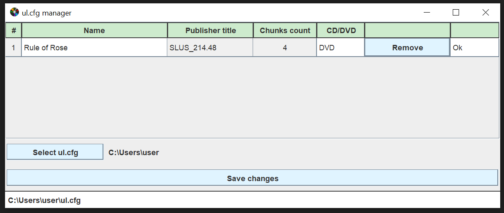

## Tihwin
  

[Russian](README_RU.md)
[Ryukyuan](README_RYU.md)
[Japanese](README_JP.md)

OPL-compatible PS2 tool for making split files. Sort of ul.cfg manager or USBUtil. Good for use on mac and linux.

#### Let's stay in touch

GitHubs are arising and passing, cozy mirrors are eternal: https://git.redrise.ru/desu/Tihwin

#### License

GNU GLPv3 or higher. Please see LICENSE.

#### Requirements

* Java

#### Feedback

Create new GitHub issue with bug report or proposition

#### Thanks

* [DDinghoya](https://github.com/DDinghoya), who translated this application to Korean!
* [Ignacio Grosso](https://github.com/blckbearx), who translated this application to Spanish!
* [kuragehime](https://github.com/kuragehimekurara1), who translated this application to Japanese and Ryukyuan languages!

#### Translations

Everyone knows that [your_language_here] is the best! And just to make sure, go create PR (pull request) or create an issue with translated `.../src/main/resources/locale.properties`

(BTW, to convert files of any locale to readable format (and vise-versa) you can use this site [https://itpro.cz/juniconv/](https://itpro.cz/juniconv/))

#### Support

Give a star on GitHub
