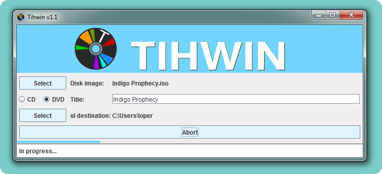
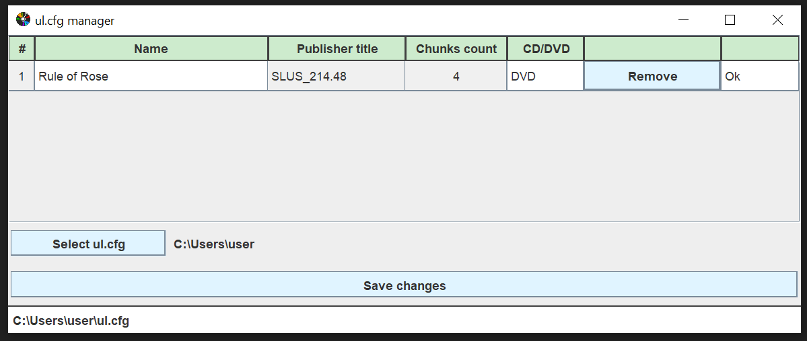

<!--@nrg.languages=en,es,id,ja,ru,ryu-->
<!--@nrg.defaultLanguage=en-->

## Tihwin
  

#### ${en:'Other languages', es:'Otros idiomas', id:'Bahasa Lain', ja:'他の言語', ru:'Другие языки', ryu:'他ぬ言語'}
<!--es-->
<!--id-->
<!--ja-->
<!--ru-->
<!--ryu-->
<!--en-->
<!--es-->
<!--id-->
<!--ja-->
<!--ryu-->
<!--en-->
<!--id-->
<!--ja-->
<!--ru-->
<!--ryu-->
<!--en-->
<!--es-->
<!--id-->
<!--ru-->
<!--ryu-->
 (Ryukyuan)<!--en-->
 (Ryukyuan)<!--es-->
 (Ryukyuan)<!--id-->
 (琉球諸語)<!--ja-->
 (Рюкюские языки)<!--ru-->
<!--en-->
<!--ru-->

${en:'OPL-compatible PS2 tool for making split files. Sort of ul.cfg manager or USBUtil. Good for use on mac and linux.', es:'Herramienta compatible con OPL para crear archivos de juego fraccionados. Similar a "ul.cfg manager" o "USBUtil". Compatible con Mac y Linux.', id:'Tihwin adalah alat yang kompatibel dengan OPL untuk membuat berkas permainan yang terbagi menjadi beberapa bagian (fragmented). Mirip dengan "ul.cfg manager" atau "USBUtil", dan mendukung sistem operasi Mac serta Linux.', ja:'分割ファイルを作成するためのOPL互換のPS2ツール。 ul.cfg ネージャーまたはUSBUtilの並べ替え。MacおよびLinuxでの使用に適しています。', ru:'Это OPL-совместимая утилита для PS2. Используется для создания т.н. «сплит-файлов». Это что-то вроде менеджера ul.cfg или, другими словами, аналог USBUtil. Отличной подойдёт для использования в маке и линуксе.', ryu:'分割ファイル作成するたみぬOPL互換ぬPS2ツール。 ul.cfgマネージャーあらんでぃUSBUtilぬ並べい替い。MacうゆびLinuxっしぬ使用んかい適ちょーいびーん。'}

#### ${en:"Let's stay in touch", es:'Mantengámonos en contacto', id:'Tetap Terhubung', ja:'連絡を取り合いましょう', ru:'Не будем теряться!', ryu:'連絡取り合やびら'}

${en:'GitHubs are arising and passing, cozy mirrors are eternal: https://git.redrise.ru/desu/Tihwin', es:'Los repositorios de GitHub vienen y van, los mirrors son eternos:  https://git.redrise.ru/desu/Tihwin', id:'Repositori GitHub bisa datang dan pergi, tetapi mirror akan selalu ada: [https://git.redrise.ru/desu/Tihwin](https://git.redrise.ru/desu/Tihwin)', ja:'GitHubは生まれては過ぎ去り、居心地の良いミラーは永遠です。 https://git.redrise.ru/desu/Tihwin', ru:'Гитхабы приходят и уходят, уютные зеркала же − вечны! https://git.redrise.ru/desu/Tihwin', ryu:'GitHubーんまりてー過ぎ去い、居心地ぬゆたさるミラーや永遠やいびーん。 https://git.redrise.ru/desu/Tihwin'}

#### ${en:'License', es:'Licencia', id:'Lisensi', ja:'ライセンス', ru:'Лицензия', ryu:'ライセンス'}

GNU GLPv3 ${en:'or higher. Please see LICENSE.', es:'o más reciente. Por favor ver LICENSE.', id:'atau versi yang lebih baru. Silakan lihat berkas LICENSE untuk informasi lengkap.', ja:'以降。 ライセンスをご覧ください。', ru:'или выше. Ознакомьтесь с файлом LICENSE.', ryu:'以降。 ライセンスんーちくぃみそーれー。'}

#### ${en:'Requirements', es:'Requisitos', id:'Persyaratan', ja:'要件', ru:'Требования', ryu:'要件'}

* ${en:'Java (no need if Installer.exe used)', es:'Java (no es necesario si se utiliza Installer.exe)', id:'Java (tidak diperlukan jika menggunakan `Installer.exe`)', ja:'Java', ru:'Java (не требуется при использовании Installer.exe)', ryu:'Java'}

#### ${en:'Feedback', es:'Comentarios', id:'Masukan', ja:'フィードバック', ru:'Обратная связь', ryu:'フィードバック'}

${en:'Create new GitHub issue with bug report or proposition', es:'Crea una nueva entrada en "Issues" con un reporte de error o una propuesta para ayudar al desarrollo del software.', id:'Silakan buat entri baru di bagian “Issues” jika menemukan bug, atau jika memiliki saran dan ide untuk membantu pengembangan aplikasi ini.', ja:'バグレポートまたは提案で新しいGitHub issueを作成してください', ru:'Просто создайте новую issue с отчётом об ошибке или предложением.', ryu:'バグレポートあらんでぃ提案っしみーさるGitHub issue作成しみそーれー'}

#### ${en:'Thanks', es:'Agradecimientos', id:'Ucapan Terima Kasih', ja:'感謝', ru:'Особая благодарность за перевод', ryu:'感謝'}

* [DDinghoya](https://github.com/DDinghoya)${en:', who translated this application to Korean!', es:', quien tradujo la app a Coreano!', id:' — menerjemahkan aplikasi ke Bahasa Korea', ja:', このアプリケーションを韓国語に翻訳しました！', ru:' на Корейский!', ryu:', くぬアプリケーション韓国語んかい翻訳さびたん！'}
* [Ignacio Grosso](https://github.com/blckbearx)${en:', who translated this application to Spanish!', es:', quien tradujo la app a Español!', id:' — menerjemahkan aplikasi ke Bahasa Spanyol', ja:', このアプリケーションをスペイン語に翻訳しました！', ru:' на Испанский!', ryu:', くぬアプリケーションスペイン語んかい翻訳さびたん！'}
* [kuragehime](https://github.com/kuragehimekurara1)${en:', who translated this application to Japanese and Ryukyuan languages!', es:', quien tradujo la app a Japonés y Ryukyuan!', id:' — menerjemahkan aplikasi ke Bahasa Jepang dan Ryukyuan', ja:', このアプリケーションを日本語と琉球諸語に翻訳しました！', ru:' на Японский и языки Рюкю!', ryu:', くぬアプリケーションやまとぅぐちとぅるーちゅー諸語んかい翻訳さびたん！'}
* [rizkyghofur](https://github.com/rizkyghofur), who translated this application to Indonesian!<!--en-->
* [rizkyghofur](https://github.com/rizkyghofur) — menerjemahkan aplikasi ke Bahasa Indonesia<!--id-->
* [rizkyghofur](https://github.com/rizkyghofur) на Индонезийский!<!--ru-->
* [Mateus](https://github.com/mateus0sh), who translated this application to Brazilian Portuguese!<!--en-->
* [Mateus](https://github.com/mateus0sh), на португальский язык Бразилии!<!--ru-->

#### ${en:'Translations', es:'Traducciones', id:'Terjemahan', ja:'翻訳', ru:'Переводы', ryu:'翻訳'}

${en:"Everyone knows that [your_language_here] is the best! And just to make sure, go create PR (pull request) or create an issue with translated `.../src/main/resources/locale.properties`", es:'Todos sabemos que [tu_idioma] es el mejor! Por esto, por favor crea un "PR" ("Pull Request") o un "Issue" con el archivo `.../src/main/resources/locale.properties` traducido a tu idioma.', id:'Kita semua tahu bahwa bahasamu adalah yang terbaik! Karena itu, kamu bisa membantu dengan membuat **Pull Request (PR)** atau **Issue** yang berisi terjemahan berkas `.../src/main/resources/locale.properties` ke dalam bahasamu.', ja:'[あなたの言語]が最高であることは誰もが知っています！PR (pull request)を作成するか、翻訳された `.../src/main/resources/locale.properties`でissueを作成してください。', ru:'Все знают что [вставьте_сюда_ваш_родной_язык] просто лучший! Вообще, просто на всякий случай, сделайте PR (пул реквест) или создайте issue с переведённым файлом `.../src/main/resources/locale.properties`', ryu:'[うんじゅが言語]やしがじょーとぅーやんくとーたーんが知っちょーいびーん！PR (pull request)作成すが、翻訳さったん `.../src/main/resources/locale.properties`でぃissue作成しみそーれー。'}

(${en:'BTW, to convert files of any locale to readable format (and vise-versa) you can use this site', es:'Por cierto, para convertir archivos de cualquier idioma a un formato legible (y viceversa) puedes utilizar este sitio', id:'Sebagai catatan, kamu dapat menggunakan situs ini untuk mengonversi berkas antar format:', ja:'任意のロケールのファイルを読み取り可能な形式に変換する (およびその逆) には、このサイトを使用できます', ru:'Кстати, чтобы конвертировать фалйы ил любой локали в читабельный формат и обратно, можете воспользоваться этим сайтом', ryu:'任意ぬロケールぬファイル読み取い可能やる形式んかい変換すん (うゆびうぬ逆) んかえー、くぬサイト使用なやびーん'} [https://itpro.cz/juniconv/](https://itpro.cz/juniconv/))

#### ${en:'Support', es:'Apoyo', id:'Dukungan', ja:'支援', ru:'Как поддержать', ryu:'支援'}

${en:'Give a star on GitHub', es:'Dale una estrella al proyecto en GitHub.', id:'Berikan bintang pada proyek ini di GitHub untuk mendukung pengembangannya.', ja:'GitHubでstarを付ける', ru:'Да просто влепите звездочку GitHub', ryu:'GitHubっしstarちきーん'}
